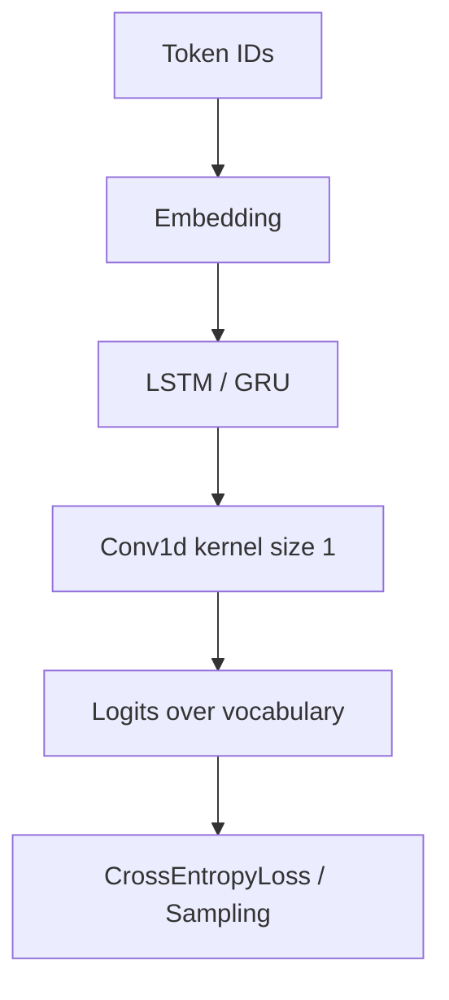

# My Own Tolkien Generative Model

<div align="center">


**Учебная генеративная языковая модель на PyTorch, обученная продолжать текст в стиле “The Lord of the Rings”.**

</div>

---

## О проекте

**My Own Tolkien Generative Model** — учебный NLP-проект, в котором реализована простая авторегрессионная языковая модель для генерации текста.

Модель обучается на корпусе `lord_of_the_rings.puncto.txt`: получает последовательность символов или токенов и учится предсказывать следующий элемент. После обучения ей можно передать начальный prompt, например `Smeagol and Boromir`, и сгенерировать продолжение текста.

Главная цель проекта — руками пройти базовый pipeline языкового моделирования: от подготовки текста и токенизации до обучения LSTM/GRU-модели и генерации последовательностей.

---

## Что реализовано

* загрузка и очистка текстового корпуса;
* character-level токенизация;
* word-level токенизация через регулярные выражения;
* построение словаря `token → id` и обратного алфавита;
* autoregressive dataset: `input` и `target`, сдвинутые на один шаг;
* модели на PyTorch:

  * `LSTMEmbPredictor`;
  * `GRUEmbPredictor`;
* embedding-слой для токенов;
* обучение через `CrossEntropyLoss`;
* training loop с Adam и OneCycleLR;
* визуализация loss и learning rate;
* генерация текста по prefix;
* temperature sampling;
* top-k filtering;
* простая постобработка сгенерированного текста.

---

## Как это работает

```text
текстовый корпус
      ↓
токенизация: characters / words
      ↓
словарь token → id
      ↓
autoregressive dataset
      ↓
Embedding → LSTM / GRU → logits
      ↓
предсказание следующего токена
      ↓
generation with temperature + top-k sampling
```

На обучении модель получает пары:

```text
input:  Frodo wen
 target: rodo went
```

То есть она учится на каждом шаге предсказывать следующий символ или токен.

---

## Архитектура модели



`Conv1d` с `kernel_size=1` здесь работает как линейный слой, который применяется к каждому временному шагу и переводит hidden state в распределение по словарю.

---

## Основные файлы

```text
.
├── my_generative_model_tolkien.ipynb   # основной notebook с обучением и генерацией
└── books/
    └── lord_of_the_rings.puncto.txt    # текстовый корпус
```

---

## Быстрый старт

### 1. Установить зависимости

```bash
pip install torch tqdm matplotlib
```

### 2. Запустить notebook

Открой `my_generative_model_tolkien.ipynb` в Jupyter Notebook или Google Colab и выполни ячейки по порядку.

### 3. Пример генерации

```python
infer(model_large, "Smeagol and Boromir", ds, 200, temperature=0.8, top_k=50)
```

---

## Что я изучил в этом проекте

Проект помог разобраться с базовыми элементами языкового моделирования:

* как текст превращается в токены;
* зачем нужен словарь и mapping;
* как устроен autoregressive dataset;
* почему target сдвигается на один шаг;
* как LSTM/GRU работают с последовательностями;
* как обучать модель предсказывать следующий токен;
* как temperature и top-k влияют на генерацию текста.

---

## Ограничения

Это учебная модель, а не полноценная LLM. Она обучается на небольшом корпусе, работает с простыми токенизаторами и может генерировать грамматически неровный или склеенный текст. Ценность проекта — не в качестве генерации на уровне современных больших моделей, а в том, что весь базовый pipeline language modeling реализован вручную.

---

## Лицензия

MIT License.
